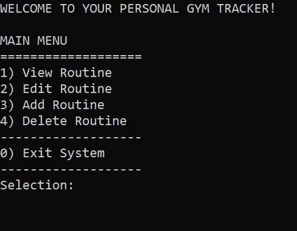
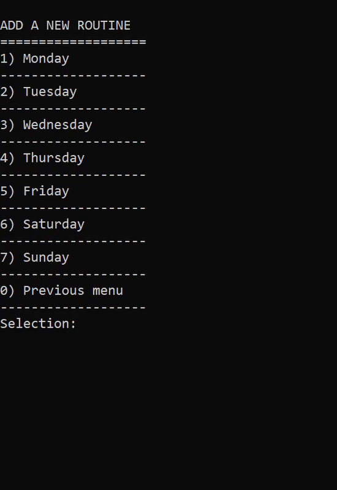
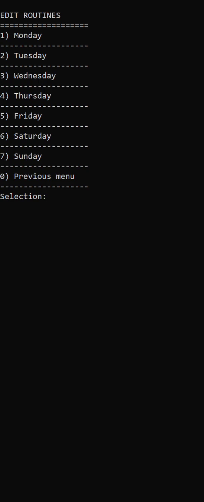

# Gym Tracker

 

> This project is a simple command-line-based application designed to help fitness enthusiasts organize and manage their workout routines. It provides a user-friendly interface for users to view, edit, add, and delete workout routines for each day of the week. It offers a comprehensive solution for individuals looking to maintain a structured and efficient fitness regimen by simplifying the tracking of exercises, weight, sets, repititions and additional notes. The program utilizes a file handling mechanism to store user workout data. Each day of the week corresponds to a file and exercises are stored in these files. This approach ensures that workout progress updates are synchronized and can be retrieved each time the user starts the program.

## Total Development Period

> 11-24-2023 ~ 12-02-2023

## Tech Stack

## Project Objectives

> ### Build something practical:
>
> The primary goal of this project is to deepen my understanding of the C language while creating practical solutions. Inspired by a personal need, I aim to develop an in-depth application akin to a diary, facilitating meticulous tracking of workout experiences and progress.
>
> ### Learn file handling with data structures:
>
> My introduction to programming left me feeling unsatisfied with the depth of understanding I gained in file handling mechanisms. To improve my skills in data structures, pointers, and file handling, I aim to delve deeper into these concepts through practical application.

## Features

> ### Create:
>
> Allows users to create new workout routines for each day of the week. Users can up to 15 exercises with details such as the exercise name, weight, sets, repetitions, and additional notes, which are then saved to specific files representing each day of the week.
>
> ### Read:
>
> Users can easily view existing workout routines for each day of the week. The program provides a user-friendly interface to visualize and review workout details stored in the respective files corresponding to each day.
>
> ### Update:
>
> Ssers have the flexibility to update existing workout routines to adapt to evolving fitness goals. Users can modify exercise details such as weight, sets, repetitions, and notes, ensuring that their workout plans remain up-to-date and tailored to their preferences.
>
> ### Delete:
>
> Enables users to delete outdated or irrelevant workout routines from their schedule. Users can remove exercises that are no longer part of their fitness regimen, helping to keep their workout plans organized and focused on their current goals.

  
  

## Project Challenges

> - Making the file operations seamless whilst implementing multiple structs. I ran into data being overwritten or date being read incorrectly often.
> - Figuring out how to delete specific exercises while maintaining the integrity of the existing data. This required me to create robust operations that shifted the indices left accordingly.

## Project Takeaways

> - I've become comfortable dealing with file handling operations and built a strong foundation for my understanding of data structures.
> - Learned to identify what it means to tackle a real-world problem and/or need and delivering a solution.
> - Solidified my understanding of basic programming with C as my first language and this application as my first project which has pushed me to easily grasp concepts and other languages.

## Installation

> - Clone the repository: git clone https://github.com/joond10/gym-tracker.git
> - Navigate to the project directory: cd gym_tracker
> - Compile the program: gcc main.c -o gym_tracker
> - Run the program: ./gym_tracker
