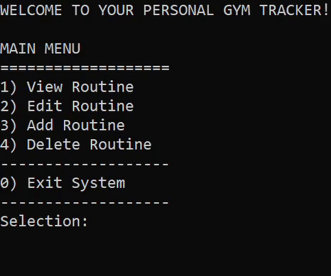

# Gym Tracker

 

> This project is a simple command-line-based application designed to help fitness enthusiasts organize and manage their workout routines. It provides a user-friendly interface for users to view, edit, add, and delete workout routines for each day of the week. It offers a comprehensive solution for individuals looking to maintain a structured and efficient fitness regimen by simplifying the tracking of exercises, weight, sets, repititions and additional notes. The program utilizes a file handling mechanism to store user workout data. Each day of the week corresponds to a file and exercises are stored in these files. This approach ensures that workout progress updates are synchronized and can be retrieved each time the user starts the program.

## Total Development Period

> 11-24-2023 ~ 12-02-2023

## Tech Stack

## Project Objectives

> ### Build something practical:
>
> The primary goal of this project is to deepen my understanding of the C language while creating practical solutions. Inspired by a personal need, I aim to develop an in-depth application akin to a diary, facilitating meticulous tracking of workout experiences and progress.
>
> ### Learn file handling with data structures:
>
> My introduction to programming left me feeling unsatisfied with the depth of understanding I gained in file handling mechanisms. To improve my skills in data structures, pointers, and file handling, I aim to delve deeper into these concepts through practical application.

## Features

### Create

### Read

### Update

### Delete

## Project Challenges

> - I went into this project not knowing anything about the flexbox layout model in CSS. Initially, I tried to design and develop the styling without it which proved to be difficult. In the the process, I learned about flexbox which provided a more efficient way to arrange, align, and distribute space among items in a container, even when their size is unknown or dynamic. Even then, I found it difficult to accomplish what I had in mind but I was able to successfully implement nested flexbox layouts as shown by the information displayed upon action button hover.
> - Testing my web application on various devices revealed viewport issues. Although it appeared as intended on my own device, discrepancies arose on others. To address this, I employed percentage-based dimensions for the images by wrapping them in a container and manipulating that as opposed to the images. This ensured dynamic sizing relative to the user's screen, regardless of resolution variations.

## Project Takeaways

> - I became comfortable and proficient with the inspector tool, breaking down layouts into boxes and containers which ensured accuracy to minimize backtracking during development.
> - I've learned my lesson to prioritize cross-browser and cross-device checking for precise measurements.
> - For future projects, I will embrace pre-implementation design during the planning stages before actual implementation.
> - Developed a discerning eye for detecting misalignments and inconsistencies.
